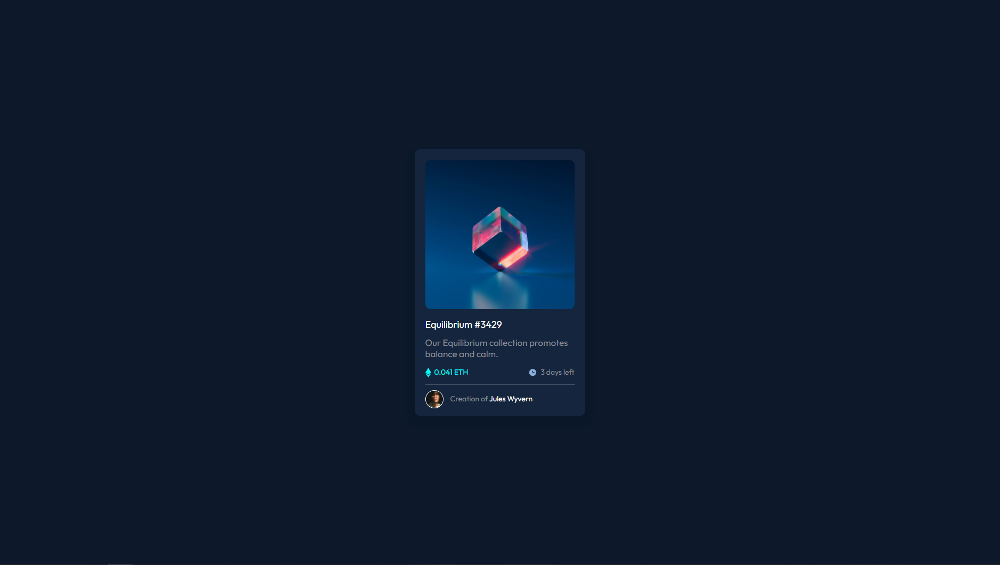

# NFT preview card component

This is a solution to the [NFT preview card component challenge on Frontend Mentor](https://www.frontendmentor.io/challenges/nft-preview-card-component-SbdUL_w0U). Frontend Mentor challenges help you improve your coding skills by building realistic projects.

## Overview
### The challenge

Users should be able to:

- View the optimal layout depending on their device's screen size
- See hover states for interactive elements

### Screenshot

### Links

- Live Site URL: [Live Site]()

### Build with

- HTML
- CSS
- Flexbox

### What I learned
I must say that this code isn't perfect, but I learned a lot of new things. I decided to keep this code because It'd take to much time to change all code but I won't make those mistakes next time :) 
